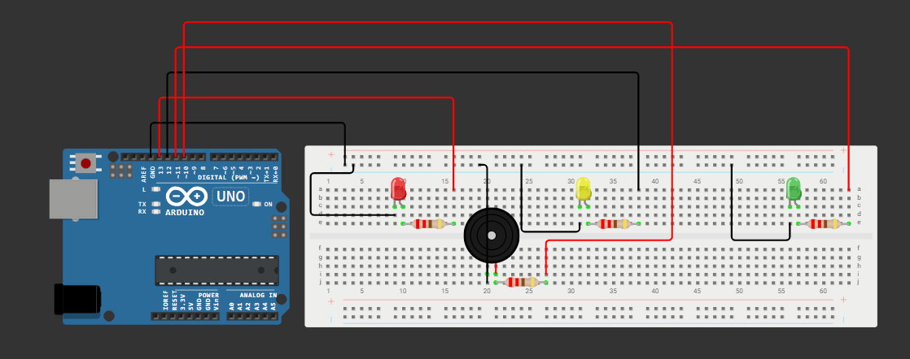
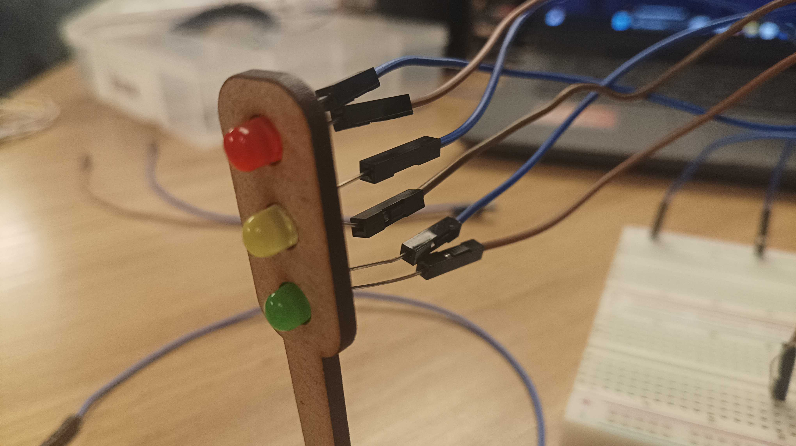
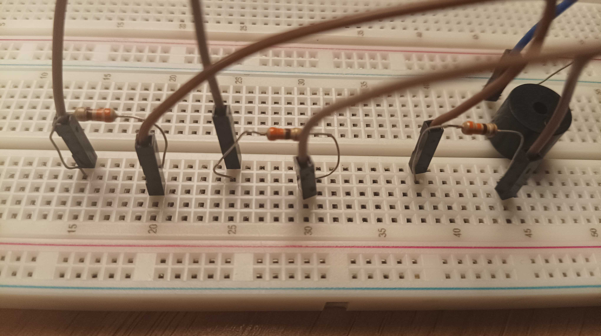
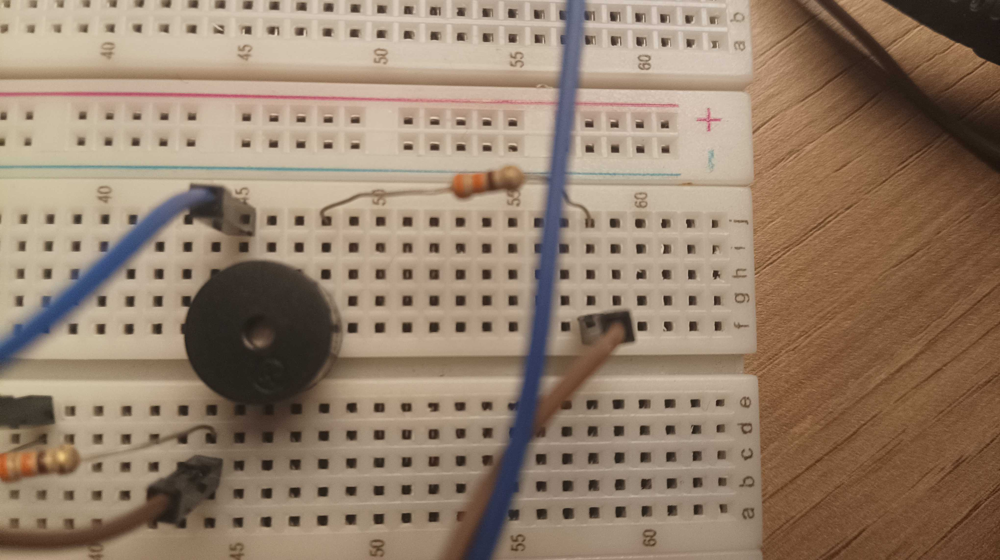

# Documentação - ponderada: semáforo offline
<div align = "center">
    
</div>
<br>

## Atividade realizada por
<a href="https://www.linkedin.com/in/luana-de-jesus-lima/">Luana de Jesus Lima</a> 

## Sumário

[1. Introdução](#c1)

[2. Simulação no Wokwi](#c2)

[3. Montagem física](#c3)

[4. Resultados das avaliações em pares](#c4)

[5. Conclusão](#c5)

<br><br>


## <a name = "c1"></a> 1 Introdução
&nbsp; &nbsp; &nbsp; &nbsp;Imagine só se cidades como São Paulo, Rio de Janeiro e tantas outras não tivessem semáforos para controlar o trânsito (com o tanto de veículos que existem nessas cidade)? Pois é, seria um completo caos!

&nbsp; &nbsp; &nbsp; &nbsp;Existem cidades sim que não possuem nenhum semáforo, é verdade. Gramado, cidade turística no Rio Grande do Sul, é um exemplo delas! Literalmente, não há nenhum semáforo lá, a prioridade é sempre do pedestre. No entanto, essa é uma realidade cada vez mais distante das grandes cidades brasileiras.

&nbsp; &nbsp; &nbsp; &nbsp;Mas por que mencionar tudo isso? Bom, neste projeto vamos criar um semáforo com LEDs, resistores, arduino e até mesmo um buzzer para indicar a transição do sinal amarelo para o vermelho. Primeiro, vamos simulá-lo na plataforma Wokwi e, depois, testá-lo na prática com os componentes eletrônicos que foram citados acima. Vamos lá?

## <a name = "c2"></a> 2 Simulação no Wokwi
&nbsp; &nbsp; &nbsp; &nbsp;Basicamente, o Wokwi é uma plataforma de simulação de projetos de robótica. Ela ajuda muito, afinal você pode testar seu projeto virtualmente antes mesmo da montagem física, o que pode te ajudar a não queimar componentes eltrônicos. Você pode usar ele tanto online (Wokwi online) como offline (por meio do VS Code).

&nbsp; &nbsp; &nbsp; &nbsp;Quer saber como ficou a simulação no Wokwi? [Clique aqui](https://wokwi.com/projects/445993128885728257)

&nbsp; &nbsp; &nbsp; &nbsp;Caso queira ver como ficou o circuito montado na simulação, a figura 1 mostra ele.

<div align = "center">
    <p>Figura 1 - simulação no Wokwi</p>
    
    <p>Fonte: material produzido pela autora no Wokwi (2025).</p>
</div>

&nbsp; &nbsp; &nbsp; &nbsp;Código:

```cpp
//Chamando a biblioteca do Arduino.
#include <Arduino.h>

//Declarando as portas dos LEDs.
uint32_t portaLEDVermelho = 13;
uint32_t portaLEDAmarelo = 12;
uint32_t portaLEDVerde = 11;

//Declarando a porta do buzzer.
uint32_t portaBuzzer = 10;

//Declarando as variáveis de tempo.
unsigned long tempoAtual;
unsigned long tempoAnterior = 0;
unsigned long tempoQuePassou;

//Variável para armazenar o estado do LED (0 é vermelho, 1 é amarelo e 2 é verde).
int led = 0;

void setup() {
  //Configurando os LEDs como dispositivos de saída.
  pinMode(portaLEDVermelho, OUTPUT);
  pinMode(portaLEDAmarelo, OUTPUT);
  pinMode(portaLEDVerde, OUTPUT);
  pinMode(portaBuzzer, OUTPUT);

  Serial.begin(115200);
}

//Função para ligar o LED.
void ligarLED(int corDoLED){
  bool taLigado = true;
  switch(corDoLED){
    case 0:
    	digitalWrite(portaLEDVermelho, taLigado);
    	digitalWrite(portaLEDAmarelo, !taLigado);
    	digitalWrite(portaLEDVerde, !taLigado);
    	break;
    case 1:
    	digitalWrite(portaLEDVermelho, !taLigado);
    	digitalWrite(portaLEDAmarelo, !taLigado);
    	digitalWrite(portaLEDVerde, taLigado);
    	break;
    case 2:
    	digitalWrite(portaLEDVermelho, !taLigado);
    	digitalWrite(portaLEDAmarelo, taLigado);
    	digitalWrite(portaLEDVerde, !taLigado);
    	break;
    default:
    	Serial.println("Meu caro dev, a porta do pino inserida não existe.");
  }
}

//Função para tocar um alerta sonoro quando o led for o amarelo.
void tocarAlerta(){
  if(led == 2){
    tone(portaBuzzer, 500);
  }else{
    noTone(portaBuzzer);
  }
}

//Função para trocar o LED que está aceso dado o tempo de cada um.
void trocarLED(){
  led++;
  tempoAnterior = tempoAtual;

  //Quando o sinal estiver no amarelo, tocar um alerta sonoro.
  tocarAlerta();

  if(led > 2){
    led = 0;
  }
}

//Função para ligar o semáforo com base nos tempos definidos para cada led.
void ligarSemaforo(){
   //Chamando a função millis().
  tempoAtual = millis();
  tempoQuePassou = tempoAtual - tempoAnterior;
  
  //LED vermelho ligado.
  if(led == 0){
    ligarLED(0);
    if(tempoQuePassou >=6000){
      trocarLED();
    }
  }
  
  //LED verde ligado.
  else if(led == 1){
    ligarLED(1);
    if(tempoQuePassou >=4000){
      trocarLED();
    }
  }
  
  //LED amarelo ligado.
  else if(led == 2){
    ligarLED(2);
    if(tempoQuePassou >=2000){
      trocarLED();
    }
  }
}

//Função para manter a lógica do semáforo em constante repetição.
void loop() {
	ligarSemaforo();
}
```

## <a name = "c3"></a>3 Montagem física
&nbsp; &nbsp; &nbsp; &nbsp;Após realizar a simulação no Wokwi, vamos para a montagem física do nosso projeto. Na próxima seção, veremos um tutorial de montagem com imagens, justificativas para a escolha de cada componente e um vídeo demonstrativo dessa montagem.

### 3.1 Fotos do circuito montado
&nbsp; &nbsp; &nbsp; &nbsp;Logo abaixo, nas figuras 2 e 3, o circuito montado fisicamente está apresentado. Basicamente, os fios azuis correspondem ao negativo (ligado no GND) e os marrons correspondem ao positivo (ligados nas portas digitais do arduino).

<div align = "center">
<p>Figura 2 - Foto 1 do circuito montado</p>

<p>Fonte: material produzido pela autora (2025).</p>
</div>

<br><br>


<div align = "center">
<p>Figura 3 - Foto 2 do circuito montado</p>

<p>Fonte: material produzido pela autora (2025).</p>
</div>
<br>

### 3.2 Componentes e justificativa 
&nbsp; &nbsp; &nbsp; &nbsp; O quadro 1 apresenta todos os componentes usados neste projeto, bem como suas especificações e o porquê de suas escolhas.

<div align = "center">
<p>Quadro 1 - Quadro com as especificações dos componentes utilizados</p>

|Componente| Especificação | Justificativa da escolha|
| :--- | :--- |  :--- |
| 4 resistores | 220 ohms| Deixar a intensidade da luz dos LEDs e do som do buzzer maior |
| 3 LEDs | 1 LED vermelho, 1 LED amarelo e 1 LED verde|Essas são as cores do semáforo|
| 1 buzzer | Dispositivo de saída sonora|Esse é um dos principais dispositivos de saída sonora, por isso foi escolhido. Basicamente, ele dispara um som quando o LED amarelo está ligado, indicando atenção|
| 1 protoboard |Placa com 400 pinos|Essa placa foi escolhida para realizar as ligações elétricas|
| 12 jumpers |Cabos macho-macho e macho-fêmea|Eles foram escolhidos por serem uma maneira simples e eficaz de realizar ligações elétricas|
| 1 cabo USB para arduino |Cabo para auxiliar na energização do arduino|Sem esse cabo (em um primeiro momento), não há como energizar o arduino.|

<p>Fonte: material produzido pela autora (2025).</p>
</div>

### 3.3 Tutorial com imagens
#### &nbsp; &nbsp; &nbsp; &nbsp;Passo 1: conectar os LEDs no GND (polo negativo, fios azuis) e nas portas digitais (polo positivo, fios marrons). Não esqueça que o polo positivo dos LEDs devem ser intermediados por um resistor de 220 ohms.
<div align = "center">
<p>Figura 4 - LEDs conectados com os jumpers</p>

<p>Fonte: material produzido pela autora (2025).</p>
</div>
<br><br>

<div align = "center">
<p>Figura 5 - Jumpers dos LEDs (polo positivo) ligados aos resistores de 220 ohms</p>

<p>Fonte: material produzido pela autora (2025).</p>
</div>
<br>

<div align = "center">
<p>Figura 6 - LEDs conectados nas portas digitais 13 (vermelho), 12 (amarelo) e 11 (verde)</p>

<p>Fonte: material produzido pela autora (2025).</p>
</div>
<br>


#### &nbsp; &nbsp; &nbsp; &nbsp;Passo 2: conectar o buzzer no GND (polo negativo, fio azul) e na porta digital 10 (polo positivo, fio marrom). Não esqueça que o polo positivo do buzzer deve ser intermediado por um resistor de 220 ohms.
<div align = "center">
<p>Figura 7 - LEDs conectados com os jumpers</p>

<p>Fonte: material produzido pela autora (2025).</p>
</div>
<br><br>

<div align = "center">
<p>Figura 8 - Positivo do buzzer ligado na porta 10</p>

<p>Fonte: material produzido pela autora (2025).</p>
</div>
<br>

### 3.4 Vídeo demonstrativo
&nbsp; &nbsp; &nbsp; &nbsp;Além das imagens, é possível verificar o funcionamento do semáforo a partir do seguinte vídeo: 

## <a name = "c4"></a> 4 Resultados das avaliações em pares
&nbsp; &nbsp; &nbsp; &nbsp;Depois da realização do semáforo, duas pessoas o avaliaram com base nos critérios passados pelo professor. Os quadros 2 e 3 mostram essas avaliações.
#### Avaliador 1: Isabela Rosati Peçanha
<br>

<div align = "center">
<p>Quadro 2 - Quadro com a avaliação do avaliador 1</p>

|Critério| Nota |Observações do avaliador|
| :--- | :--- |  :--- |
|Montagem física com cores corretas, boa disposição dos fios e uso adequado de resistores|3|Nenhuma
|Temporização adequada conforme tempos medidos com auxílio de algum instrumento externo|3|Nenhuma
|Código implementa corretamente as fases do semáforo e estrutura do código (variáveis representativas e comentários)|3|Nenhuma
|Ir além: Implementou um componente de extra, fez com millis() ao invés do delay() e/ou usou ponteiros no código|1|Nenhuma

<p>Fonte: material produzido pela autora (2025).</p>
</div>

#### Nota final: 10.
<br><br>

#### Avaliador 2: Luiz Felipe Paravatti Maciel Hinuy
<br>

<div align = "center">
<p>Quadro 2 - Quadro com a avaliação do avaliador 2</p>

|Critério| Nota |Observações do avaliador|
| :--- | :--- |  :--- |
|Montagem física com cores corretas, boa disposição dos fios e uso adequado de resistores|3|Nenhuma
|Temporização adequada conforme tempos medidos com auxílio de algum instrumento externo|3|Nenhuma
|Código implementa corretamente as fases do semáforo e estrutura do código (variáveis representativas e comentários)|3| Apesar do uso da estrutura de controle if-else atribuindo números aos leds em vez de switch case em loop deixar o código um pouco maior, ele continua bem organizado e inteligível pois está bem comentado.
|Ir além: Implementou um componente de extra, fez com millis() ao invés do delay() e/ou usou ponteiros no código|1|Nenhuma

<p>Fonte: material produzido pela autora (2025).</p>
</div>

#### Nota final: 10.

## <a name = "c5"></a> 5 Conclusão
&nbsp; &nbsp; &nbsp; &nbsp;Dessa forma, o semáforo desenvolvido atingiu o objetivo proposto pela atividade, com a devida demonstração em vídeo e detalhamento em código e documentação. 